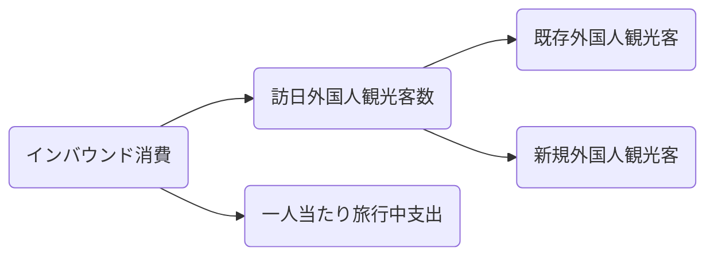

# 北原ゼミ（2024年）1班

## 進捗報告（10月31日）

### Part 1

<a href="https://github.com/omuztc/omuztc.github.io/blob/main/panel_data_analysis.ipynb" target="_blank" rel="noopener noreferrer">Python</a>

---

### Part 2

#### 【契機】訪日観光の最大の理由は「前回日本を訪れて楽しめたので、また行きたいと思ったから」（50.0%）

出典：<a href="https://www.dentsu.co.jp/news/release/2024/0703-010751.html" target="_blank" rel="noopener noreferrer">「観光目的で再訪したい国・地域」1位の日本を5つの視点（期待・契機・関心・地方・和食）で読み解く</a>

$インバウンド消費 = (訪日外国人観光客数)\times (一人当たり消費額)$

$顧客数 = 新規顧客 + 既存顧客$

<a href="https://www.mlit.go.jp/kankocho/content/001767309.pdf" target="_blank" rel="noopener noreferrer">国籍・地域別にみる訪日外国人旅行消費額と構成比</a>

<a href="https://www.mlit.go.jp/kankocho/tokei_hakusyo/content/001345781.pdf" target="_blank" rel="noopener noreferrer">訪日外国人の消費動向 訪日外国人消費動向調査結果及び分析 2019年 年次報告書</a>

中国以外で訪日旅行者数が多い国々では、日本を一度以上訪れている人が多数派である。

### モデル1

$Y = \alpha +\beta X + \varepsilon $

> 対象国・地域：中国、韓国、台湾、香港、米国

|変数名|備考|
|---|---|
|$Y$|一人当たり旅行中支出|
|$x_1$|訪日回数|
|$x_2$|モノ消費|
|$x_3$|平均泊数|
|$x_4$|満足度|
|$x_5$|団体ツアー参加率|
|$x_6$|訪問パターン|

[訪問パターン](https://www.mlit.go.jp/kankocho/content/001754303.pdf)

---

### モデル2

ロジットモデルを用いて日本への再訪意向を分析する。
